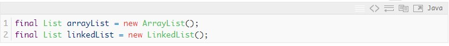

# Colecciones en JAVA

1. ## *¿Que es el JCF (JAVA COLLECTION FRAMEWORK)?*

Una colección representa un grupo de objetos. Esto objetos son conocidos como elementos. Cuando queremos trabajar con un conjunto de elementos, necesitamos un almacén donde poder guardarlos. En Java, se emplea la interfaz genérica Collection para este propósito. Gracias a esta interfaz, podemos almacenar cualquier tipo de objeto y podemos usar una serie de métodos comunes, como pueden ser: añadir, eliminar, obtener el tamaño de la colección… Partiendo de la interfaz genérica Collection extienden otra serie de interfaces genéricas. Estas subinterfaces aportan distintas funcionalidades sobre la interfaz anterior.

______

2. ## *Tipos de Colecciones*

* 2.1. **Set**: 
La interfaz **Set** define una colección que no puede contener elementos duplicados. Esta interfaz contiene los métodos heredados de **Collection** añadiendo la restricción de que los elementos duplicados están prohibidos. Es importante destacar que, para comprobar si los elementos son elementos duplicados o no lo son, es necesario que dichos elementos tengan implementada, de forma correcta, los métodos **equals** y **hashCode**. Para comprobar si dos **Set** son iguales, se comprobarán si todos los elementos que los componen son iguales sin importar en el orden que ocupen dichos elementos.

Dentro de la interfaz **Set** existen varios tipos de implementaciones realizadas dentro de la **Plataforma Java**.

* **HashSet**: Esta implementación almacena los elementos en una tabla hash. Es la implementación con mejor rendimiento de todas pero no garantiza ningún orden a la hora de realizar iteraciones.

* **TreeSet**: Esta implementación almacena los elementos ordenándolos en función de sus valores. Es bastante más lento que HashSet.

* **LinkedHashSet**: Esta implementacion almacena los elementos en función del orden del inserción. Es, simplemente, un poco mas costosa que **HashSet**

Ninguna de estas implementaciones son sincronizadas; es decir, no se garantiza el estado del Set si dos o más hilos acceden de forma concurrente al mismo. Esto se puede solucionar empleando una serie de métodos que actúan de wrapper para dotar a estas colecciones de esta falta de sincronización:

*Una vez explicados los distintos tipos de Set, veremos cómo se crean y mostraremos sus diferencias en los tiempos de inserción. Como hemos visto anteriormente, el más rápido debería ser HashSet mientras que, por otro lado, el más lento debería ser TreeSet. Vamos a comprobarlo con el siguiente código:*

Los tiempos obtenidos demuestran que, efectivamente, el tiempo de inserción es menor en HashSet y mayor en TreeSet. Es importante destacar que la inicialización del tamaño inicial del Set a la hora de su creación es importante ya que, en caso de insertar un gran número de elementos, podrían aumentar el número de colisiones y; con ello, el tiempo de inserción.

____

* 2.2. **List**: La interfaz **List** define una sucesión de elementos. A diferencia de la interfaz **Set**, la interfaz List sí admite elementos duplicados.

A parte de los métodos heredados de **Collection**, añade métodos que permiten mejorar los siguientes puntos:

* Acceso posicional a elementos: manipula elementos en función de su posición en la lista.
* Búsqueda de elementos: busca un elemento concreto de la lista y devuelve su posición.
* Iteración sobre elementos: mejora el Iterator por defecto.
* Rango de operación: permite realizar ciertas operaciones sobre ragos de elementos dentro de la propia lista.

Dentro de la interfaz List existen varios tipos de implementaciones realizadas dentro de la plataforma Java. Vamos a analizar cada una de ellas:

* **ArrayList:** esta es la implementación típica. Se basa en un array redimensionable que aumenta su tamaño según crece la colección de elementos. 

* **Linked List:** Esta implementación permite que mejore el rendimiento en ciertas ocasiones. Esta implementación se basa en una lista doblemente enlazada de los elementos, teniendo cada uno de los elementos un puntero al anterior y al siguiente elemento.

Ninguna de estas implementaciones son sincronizadas; es decir, no se garantiza el estado del List si dos o más hilos acceden de forma concurrente al mismo. Esto se puede solucionar empleando una serie de métodos que actúan de wrapper para dotar a estas colecciones de esta falta de sincronización:

A continuación, vamos a ver cómo se crean los distintos tipos de interfaces:

El cuándo usar una implementación u otra de **List** variará en función de la situación en la que nos encontremos. Generalmente, **ArrayList** será la implementación que usemos en la mayoría de situaciones. Sobretodo, varían los tiempos de inserción, búsqueda y eliminación de elementos, siendo en unos casos una solución más óptima que la otra.
____

* 2.3. **Map:** La interfaz Map asocia claves a valores. Esta interfaz no puede contener claves duplicadas y; cada una de dichas claves, sólo puede tener asociado un valor como máximo.

Dentro de la interfaz **MAP** existen varios tipos de implementaciones realizadas dentro de la plataforma **JAVA**. 

* **HashMap:** Esta implementación almacena las claves en una tabla hash. Es la implementación con mejor rendimiento de todas pero no garantiza ningún orden a la hora de realizar iteraciones.

* **TreeMap:** Esta implementación almacena las claves ordenándolas en función de sus valores. Es bastante más lento que HashMap. Las claves almacenadas deben implementar la interfaz Comparable.

* **LinkedHashMap:** esta implementación almacena las claves en función del orden de inserción. Es, simplemente, un poco más costosa que HashMap.

Ninguna de estas implementaciones son sincronizadas; es decir, no se garantiza el estado del Map si dos o más hilos acceden de forma concurrente al mismo. Esto se puede solucionar empleando una serie de métodos que actúan de wrapper para dotar a estas colecciones de esta falta de sincronización:

El cuándo usar una implementación u otra de **Map** variará en función de la situación en la que nos encontremos. Generalmente, **HashMap** será la implementación que usemos en la mayoría de situaciones. **HashMap** es la implementación con mejor rendimiento (como se ha podido comprobar en el análisis de Set), pero en algunas ocasiones podemos decidir renunciar a este rendimiento a favor de cierta funcionalidad como la ordenación de sus elementos.
____

* 2.4. **Stream API**
Gracias a la llegada de Java 8, las colecciones han aumentado su funcionalidad con la llegada de los streams. Los streams permiten realizar operaciones funcionales sobre los elementos de las colecciones.

A continuación, mostramos un ejemplo de las bondades de los streams donde, a partir de una lista de personas (donde cada una de ellas tiene un nombre), obtenemos una lista con todos los nombres:

Referencias: [GitHub](https://www.adictosaltrabajo.com/2015/09/25/introduccion-a-colecciones-en-java/)

# **By: Kevin Mendoza **