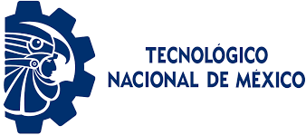

# MendozaK

## **INSTITUTO TECNOLÓGICO DE NUEVO LAREDO**

**Estudiante:** Kevin Mendoza González  

**No.Control:** 18100796  

**Materia:** Topicos avanzados de Programación 

**Acerca de mi:** Me considero una persona realmente amigable y muy paciente, me gusta mucho escuchar música y conocer a mas personas, me considero extrovertido y platicador, me gusta la carrera que estoy estudiando y aunque a veces se me dificulte siempre salgo adelante y aprendo de mis errores. 

##  **PREGUNTAS** 

**Lenguajes de programacion que conoce:** C#, C++ y un poco de Java  

**Herramientas de desarrollo que usa:** Ahora mismo solo Git  

**Ya ha trabajado antes con Git/GitHub o es su primera vez:** Es la primera vez

**Conoce usted el lenguaje Java:** Tengo entendido que Java es un lenguaje orientado a Objetos y que utiliza una sintaxis similar a la de **C++**  

**Tiene conocimientos o ha trabajado con Bases de datos:** Solo he usado para un proyecto de Programación orientada a objetos donde tenia que conectar mi programa a una base de datos.

**Conoce o alguna vez ha trabajado con el lenjuage de consultas SQL:** Conozco muy poco del tema, no he trabajado con ese lenguaje 

**¿Trabaja usted actualmente en el area de sistemas?**  
Actualmente no trabajo pero, estos dias he enviado mi CV a diversas empresas y afortunadamente me han contactado de una para entrar como practicante de sistemas.

Esto me ayuda a fortalecer mis habilidades y aptitudes para mi crecimiento profesional y emocional.
